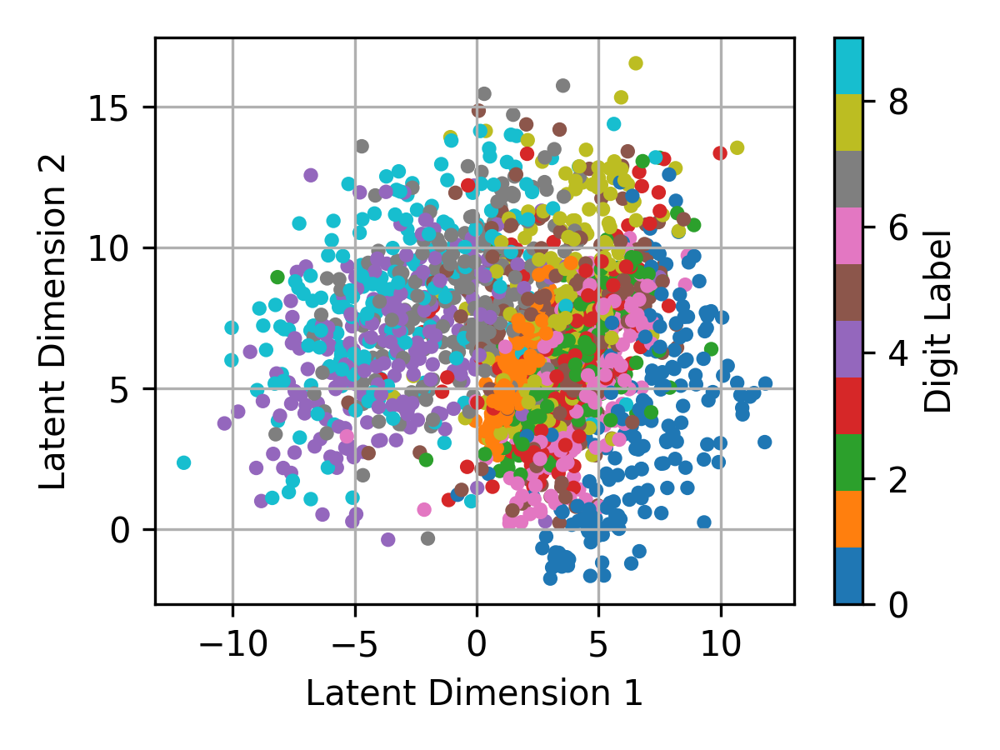
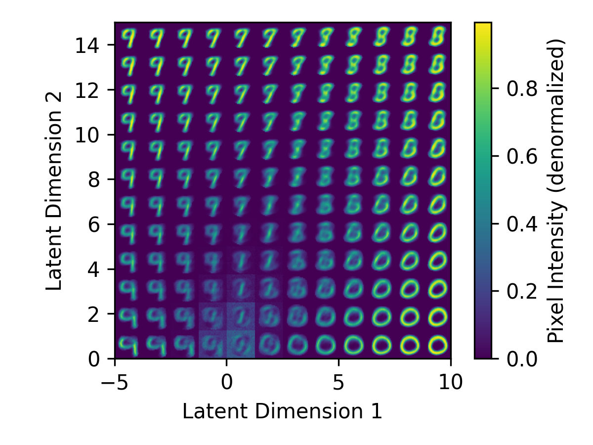
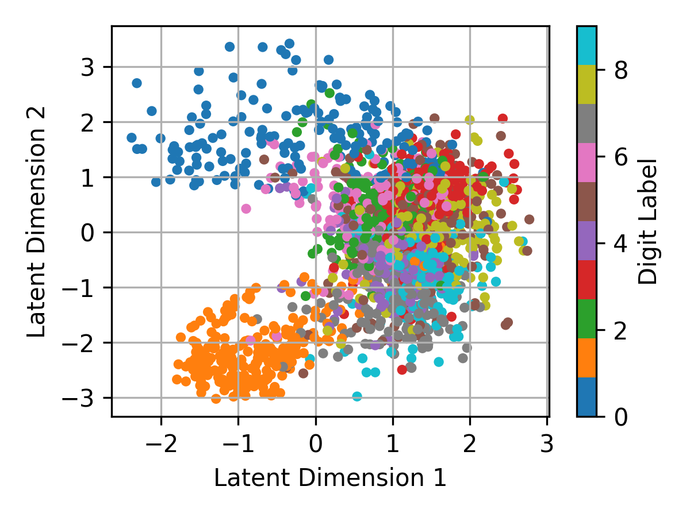
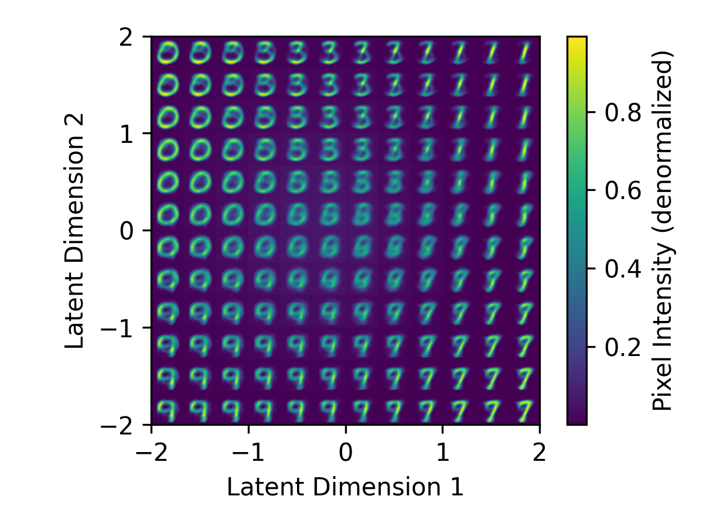

# Vanilla VAE

Minimal Autoencoder implementation in PyTorch.

| Model | Latent Space | Reconstructed Manifold | Interpolation Animation |
| :---: | :----------: | :--------------------: | :---------------------: |
| Autoencoder |  |  | </br>*0→9* |
| Variational Autoencoder |  |  | </br>*3→7* |

## Quick Start

1. Clone the repository:
    ```bash
    git clone https://github.com/donglinkang2021/VanillaVAE.git
    cd VanillaVAE
    ```

2. Install the required packages:
    ```bash
    pip install -r requirements.txt
    ```

3. Download the MNIST dataset, you can modify the `config.py` file to change the dataset path `data_root`:
    ```python
    from torchvision.datasets import MNIST
    import config
    train_dataset = MNIST(config.data_root, train=True, download=True)
    test_dataset = MNIST(config.data_root, train=False, download=True)
    ```

4. Train the model:
    ```bash
    python train.py
    ```

    And you will see the following output:

    ```bash
    Starting training VariationalAutoEncoder for 5 epochs on cuda...
    Epoch 1/5 - Test Loss: 28828.1602    
    Epoch 2/5 - Test Loss: 25873.2592    
    Epoch 3/5 - Test Loss: 24447.3148    
    Epoch 4/5 - Test Loss: 23305.9520    
    Epoch 5/5 - Test Loss: 22599.5592    
    Overall Progress: 100%|█████████| 5/5 [00:27<00:00,  5.56s/it, test loss=2.26e+4]
    Model saved to ckpts/vae_5epo.pth
    ```

5. Test the model:
    ```bash
    python test.py
    ```
    
    And you will see the following output:

    ```bash
    {'test loss': 22597.052734375}
    Latent space plot saved to plots/vae_latent_space.png
    Reconstructed manifold plot saved to plots/vae_reconstructed_manifold.png
    ```

6. Visualize the interpolations:
    ```bash
    python visualize.py
    ```

    And you will see the `.gif` files in the `plots` directory.

## References

- [Auto-Encoding Variational Bayes](https://arxiv.org/pdf/1312.6114)
- [Variational AutoEncoders (VAE) with PyTorch](https://avandekleut.github.io/vae/)
