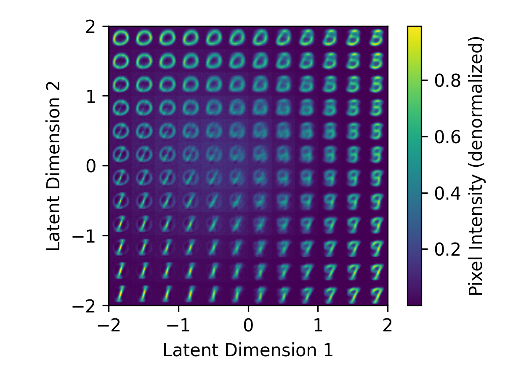

# Vanilla VAE

Minimal Autoencoder and Variational Autoencoder (VAE) implemented in PyTorch.

| Model | Autoencoder | Variational Autoencoder |
| :---: | :----------: | :---------------------: |
| Latent Space |  |  |
| Reconstructed Manifold |  |  |
| Interpolation Animation | </br>*0→9* | </br>*0→9* |

## Quick Start

1. Clone the repository:
    ```bash
    git clone https://github.com/donglinkang2021/VanillaVAE.git
    cd VanillaVAE
    ```

2. Install the required packages:
    ```bash
    pip install -r requirements.txt
    ```

3. Download the MNIST dataset, you can modify the `config.py` file to change the dataset path `data_root`:
    ```python
    from torchvision.datasets import MNIST
    import config
    train_dataset = MNIST(config.data_root, train=True, download=True)
    test_dataset = MNIST(config.data_root, train=False, download=True)
    ```

4. Train the model:
    ```bash
    python train.py
    ```

    And you will see the following output:

    ```bash
    Starting training VariationalAutoEncoder for 5 epochs on cuda...
    Epoch 1/5 - Test Loss: 0.0666
    Epoch 2/5 - Test Loss: 0.0609
    Epoch 3/5 - Test Loss: 0.0581
    Epoch 4/5 - Test Loss: 0.0560
    Epoch 5/5 - Test Loss: 0.0545
    Overall Progress: 100%|███████████████████| 5/5 [00:35<00:00,  7.02s/it, test loss=0.0545]
    Model saved to ckpts/vae_5epo.pth
    ```

5. Test the model:
    ```bash
    python test.py
    ```
    
    And you will see the following output:

    ```bash
    {'test loss': 0.054480640590190886}                                       
    Latent space plot saved to plots/vae_latent_space.png                     
    Reconstructed manifold plot saved to plots/vae_reconstructed_manifold.png 
    ```

6. Visualize the interpolations:
    ```bash
    python visualize.py
    ```

    And you will see the `.gif` files in the `plots` directory.


## Core Idea of VAE

$\{x\}$ represents our image data samples, and $X$ represents the image variable. We struggle to understand the exact distribution of $p(X)$ (making it difficult to directly sample images from this distribution). Therefore, we aim to approximate $p(X)$ by constructing an encoder $p(Z|X)$, where $p(Z)$ is intended to be a Gaussian distribution. We can sample from the Gaussian distribution to obtain $Z$, and then use a decoder $p(X|Z)$ to map $Z$ back into the image space.

Our goal in training the VAE is to minimize the difference between the original image and the reconstructed image, while using KL divergence to constrain the distribution of $Z$ to be close to a standard normal distribution.

The probability density function of a normal distribution $\mathcal{N}(\mu, \sigma^2)$ is:

$$
\begin{aligned}
p(z) &= \frac{1}{\sqrt{2\pi\sigma^2}} \exp\left(-\frac{(z-\mu)^2}{2\sigma^2}\right) \\
\log p(z) &= -\frac{1}{2}\log(2\pi\sigma^2) - \frac{(z-\mu)^2}{2\sigma^2}
\end{aligned}
$$

Our neural network, after the Encoder part, actually outputs `mu` $\mu$ and `log_var` $\log \sigma^2$.

When calculating the KL divergence, we need to calculate the KL divergence between two normal distributions $p\sim \mathcal{N}(\mu, \sigma)$ and $q\sim \mathcal{N}(0,1)$:

$$
KL(p(z), q(z)) = \int p(z) \log\left(\frac{p(z)}{q(z)}\right) dz
$$

Then we have

$$
\log q(z) = -\frac{1}{2}\log(2\pi) - \frac{z^2}{2}
$$

We can use this estimator to calculate the KL divergence:

$$
\begin{aligned}
\log \frac{p(z)}{q(z)} &= \log p(z) - \log q(z) \\
&= -\frac{1}{2}\log(2\pi\sigma^2) - \frac{(z-\mu)^2}{2\sigma^2} + \frac{1}{2}\log(2\pi) + \frac{z^2}{2} \\
&= -\log\sigma - \frac{(z-\mu)^2}{2\sigma^2} + \frac{z^2}{2} \\
\end{aligned}
$$

Then the KL divergence is:

$$
\begin{aligned}
KL(p(z), q(z)) &= \int p(z) \log\left(\frac{p(z)}{q(z)}\right) dz \\
&= \int p(z) \left(-\log\sigma - \frac{(z-\mu)^2}{2\sigma^2} + \frac{z^2}{2}\right) dz \\
&= -\log\sigma - \frac{1}{2\sigma^2} {\color{orangered}\int p(z) (z-\mu)^2 dz} + \frac{1}{2} {\color{magenta}\int p(z) z^2 dz} \\
&= -\log\sigma - \frac{1}{2\sigma^2} {\color{orangered}\mathrm{Var}_p(z)} + \frac{1}{2} {\color{magenta}\mathrm{E}_p(z^2)} \\
&= -\log\sigma - \frac{1}{2\sigma^2} {\color{orangered}\sigma^2} + \frac{1}{2} ({\color{magenta}\mathrm{Var}_p(z)+(\mathrm{E}_p(z))^2}) \\
&= -\log\sigma - \frac{1}{2} + \frac{1}{2} (\sigma^2 + \mu^2) \\
\end{aligned}
$$

So in the code, it can usually be written in one line:

```python
kl_loss = 0.5 * (mu**2 + log_var.exp() - log_var - 1).mean()
```

## References

- [Auto-Encoding Variational Bayes](https://arxiv.org/pdf/1312.6114)
- [Variational AutoEncoders (VAE) with PyTorch](https://avandekleut.github.io/vae/)
- [PyTorch VAE](https://github.com/AntixK/PyTorch-VAE/)
